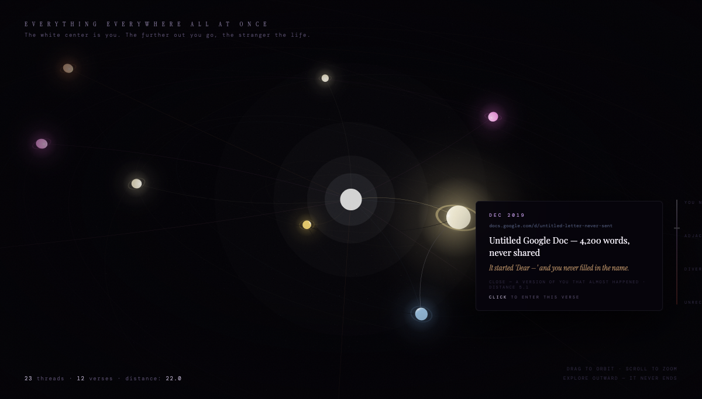

# Everything Everywhere All at Once

**Explore the parallel lives you almost lived.**



## The Problem

Your digital footprint is full of abandoned dreams. Google Docs started but never finished. Applications filled out but never submitted. 2:47am searches for careers you never pursued. Email drafts that reveal what you wanted to say but didn't.

These aren't just forgotten files — they're **evidence of lives you almost lived**.

But this data sits dormant. There's no way to see the pattern, understand what it means, or — most importantly — do something about it.

## The Solution

**Everything Everywhere All at Once** analyzes your digital footprint to surface the "paths not taken" and helps you explore — or pursue — those alternate lives.

We collect data from:
- **Google Drive** — abandoned documents, dormant projects
- **Google Docs** — drafts that never got finished
- **Gmail** — unsent messages revealing unspoken thoughts
- **Browser History via Google My Activity** — we use [Browser Use](https://browser-use.com) to scrape your recent web activity, including Google searches, YouTube rabbit holes, and sites you visited but never returned to. This reveals patterns you might not even be aware of: the career you keep researching, the place you keep looking up, the skill you keep watching tutorials about but never started.

Then we visualize your alternate lives as an interactive 3D universe, generate cinematic videos of what those lives could look like, and provide actionable steps to pull those possibilities into your current reality.

## How It Works

### 1. Data Collection
Connect your Google account. [Browser Use](https://browser-use.com) agents autonomously navigate your Google services and collect:
- **Google Drive**: Recent files, abandoned documents, dormant projects
- **Google Docs**: Started-but-unfinished drafts, word counts, collaboration patterns
- **Gmail**: Unsent drafts that reveal what you wanted to say but didn't
- **Google My Activity**: Search patterns, YouTube rabbit holes, curious obsessions, late-night browsing

### 2. AI Analysis
Claude analyzes your digital footprint to identify **paths not taken**:
- **Abandoned Projects**: Docs or files that started strong but were never finished
- **Unsent Messages**: Drafts that reveal something you wanted to say
- **Forgotten Interests**: Domains you clearly cared about but drifted away from
- **Hidden Ambitions**: Titles or content hinting at a life you were considering
- **Curious Obsessions**: Search patterns revealing fascinations you haven't acted on

### 3. 3D Universe Visualization
Your alternate lives appear as planets in an interactive 3D universe:
- **The white center is you** — your current life
- **The further out you go, the stranger the life**
- Orbiting nodes represent each "verse" — an alternate path you could have taken
- Distance zones range from "Close — a version of you that almost happened" to "Outer rim — a stranger with your eyes"

### 4. Video Generation with MiniMax
When you click on a verse, we use **MiniMax video generation** to create cinematic footage of what that alternate life looks like. This brings your "what if" to life with:
- Dreamlike, emotionally resonant visuals
- Golden-hour cinematography
- A glimpse into the life you almost lived

### 5. Pull Into This Timeline
Don't just dream about it — **do it**. The "Pull into this timeline" feature uses [Browser Use](https://browser-use.com) to:
- Generate concrete, actionable steps for THIS WEEK
- Open a **live browser session** where an AI agent navigates alongside you
- Help you actually take the first step — submitting that YC application, booking that trip, sending that message
- The agent can fill out forms, research what you need, and guide you through the process in real-time

## Architecture

```
┌──────────────────────────────────────────────────────────────────────┐
│                           Frontend                                    │
│  ┌─────────────────────────────────────────────────────────────────┐ │
│  │  Three.js 3D Universe Visualization                              │ │
│  │  - Orbiting planet nodes (each = an alternate life)              │ │
│  │  - Interactive tooltips with verse details                       │ │
│  │  - Distance-based zone system                                    │ │
│  │  - Narrative generation interface                                │ │
│  │  - Video playback for generated verses                           │ │
│  └─────────────────────────────────────────────────────────────────┘ │
└──────────────────────────────────────────────────────────────────────┘
                                    │
                                    ▼
┌──────────────────────────────────────────────────────────────────────┐
│                           Backend (FastAPI)                           │
│  ┌─────────────────┐  ┌─────────────────┐  ┌─────────────────┐       │
│  │  Auth API       │  │  Analysis API   │  │  Verses API     │       │
│  │  - Google OAuth │  │  - Path finding │  │  - Get verses   │       │
│  │  - JWT tokens   │  │  - Claude calls │  │  - Generate     │       │
│  └─────────────────┘  └─────────────────┘  └─────────────────┘       │
│  ┌─────────────────┐  ┌─────────────────┐  ┌─────────────────┐       │
│  │  Video API      │  │  Explore API    │  │  Collections    │       │
│  │  - MiniMax gen  │  │  - Live browser │  │  - Google data  │       │
│  │  - Status poll  │  │  - Agent assist │  │  - History data │       │
│  └─────────────────┘  └─────────────────┘  └─────────────────┘       │
└──────────────────────────────────────────────────────────────────────┘
                                    │
                    ┌───────────────┼───────────────┐
                    ▼               ▼               ▼
            ┌─────────────┐  ┌─────────────┐  ┌─────────────┐
            │ Claude API  │  │ MiniMax API │  │ Browser Use │
            │ (Analysis + │  │ (Video Gen) │  │ (Live Agent │
            │  Narrative) │  │             │  │  Sessions)  │
            └─────────────┘  └─────────────┘  └─────────────┘
```

## Tech Stack

| Component | Technology |
|-----------|------------|
| 3D Visualization | Three.js |
| Frontend Framework | Vanilla JS / Next.js |
| Backend | FastAPI (Python) |
| Database | SQLite with async support |
| AI Analysis | Claude API (Anthropic) |
| Narrative Generation | Claude Sonnet |
| Video Generation | MiniMax |
| Browser Automation | Browser Use API |
| Authentication | Google OAuth 2.0 + JWT |
| Browser Extension | Chrome Extension (TypeScript) |

## Project Structure

```
EverythingEverywhereAllAtOnce/
├── backend/
│   ├── app/
│   │   ├── agents/           # Browser automation agents
│   │   │   ├── google_agent.py    # Collects Google Drive/Docs/Gmail
│   │   │   └── history_agent.py   # Collects browser history
│   │   ├── api/
│   │   │   ├── analysis.py   # Path-not-taken analysis endpoints
│   │   │   ├── verses.py     # Verse data + narrative generation
│   │   │   ├── video.py      # Video generation with MiniMax
│   │   │   └── explore.py    # Live browser exploration
│   │   ├── services/
│   │   │   └── analysis_service.py  # Claude-powered life analysis
│   │   └── models/           # Database models
│   └── requirements.txt
├── frontend/                 # Next.js frontend
├── extension/                # Chrome extension for data collection
├── index.html               # Standalone 3D universe demo
└── videos/                  # Pre-generated verse videos
```

## Key Features

### Universe Navigation
- **Drag** to orbit around your multiverse
- **Scroll** to zoom in/out (infinite zoom)
- **Hover** over planets to see verse details
- **Click** to enter a verse and explore that alternate life

### Distance Zones
| Zone | Distance | Description |
|------|----------|-------------|
| Close | 4-6 | A version of you that almost happened |
| Adjacent | 8-12 | A familiar life, tilted |
| Divergent | 14-18 | You might not recognize yourself |
| Far Reach | 22-28 | Barely you anymore |
| Outer Rim | 35-45 | A stranger with your eyes |

### Verse Interactions
1. **Generate This Verse** — Creates a cinematic narrative of that alternate life
2. **Pull Into This Timeline** — Actionable steps to make it happen THIS WEEK
3. **Remix This Verse** — Explore variations on that alternate path
4. **Let Go** — Acknowledge and release that path

## Setup

### Prerequisites
- Python 3.11+
- Node.js 18+
- Google Cloud Project with OAuth configured
- API Keys: Anthropic (Claude), MiniMax, Browser Use

### Environment Variables

```bash
# Backend
DATABASE_URL=sqlite+aiosqlite:///./app.db
SECRET_KEY=your-secret-key
ANTHROPIC_API_KEY=your-anthropic-key
FAL_API_KEY=your-fal-key  # For video generation
BROWSER_USE_API_KEY=your-browser-use-key
CORS_ORIGINS=http://localhost:3000

# Frontend
NEXT_PUBLIC_API_URL=http://localhost:8000
```

### Running Locally

```bash
# Backend
cd backend
pip install -r requirements.txt
uvicorn app.main:app --reload

# Frontend
cd frontend
npm install
npm run dev
```

## The Philosophy

> "Your unsent messages outnumber your sent ones 3:1. The ratio is the story."

> "The 2:47am searches appear in every timeline. The difference is what happens at 2:48."

> "Every version of you writes. Only one finishes. The difference isn't talent — it's tolerance for being bad."

With the help of parallel agents, we believe you should be empowered to explore your full potential in all domains. Not just imagine it — **live it**.

**Everything. Everywhere. All at once.**

---

*Built with Claude, MiniMax, and the belief that the life you almost lived is still waiting for you.*
